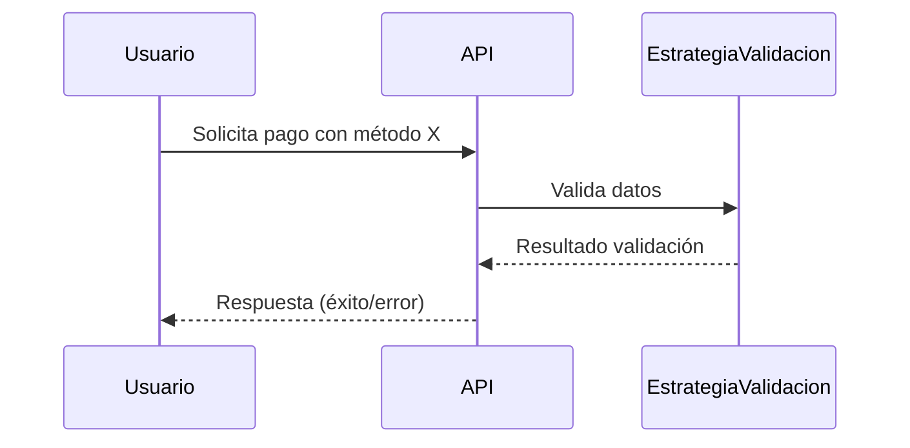

# Proyecto MIA203


La API está disponible en [https://mia203.onrender.com](https://mia203.onrender.com)

La documentación está disponible en [https://mia203.onrender.com/docs](https://mia203.onrender.com/docs)

## Integrantes

- María Luisa Boettner
- Hernán Marano

## Decisiones de Diseño

### Uso del Patrón Strategy para Validación

Se eligió implementar el patrón Strategy para la validación de métodos de pago por las siguientes razones:

- **Extensibilidad:** Permite agregar fácilmente nuevos métodos de pago y sus validaciones específicas sin modificar el código existente. Cada método de pago tiene su propia estrategia de validación encapsulada en una clase independiente.
- **Separación de responsabilidades:** La lógica de validación de cada método de pago está aislada, lo que facilita el mantenimiento y la comprensión del código.
- **Testabilidad:** Al tener cada estrategia en una clase separada, es sencillo escribir tests unitarios específicos para cada tipo de validación, asegurando que los cambios en una estrategia no afecten a las demás.
- **Trade-offs:** Se consideró usar condicionales simples (if/elif) para la validación, pero esto haría el código menos escalable y más difícil de mantener a medida que se agregan nuevos métodos de pago. El patrón Strategy implica mayor cantidad de clases, pero mejora la organización y la flexibilidad.
- **Desacoplamiento:** El controlador principal no necesita conocer los detalles de cada validación, solo delega la responsabilidad a la estrategia correspondiente.

En resumen, el patrón Strategy fue elegido para favorecer la modularidad, la escalabilidad y la claridad en la lógica de validación de pagos, alineándose con buenas prácticas de diseño orientado a objetos.

### Uso del Patrón Factory Method

La clase `PaymentMethodValidationStrategyFactory` implementa el patrón Factory Method para instanciar la estrategia de validación adecuada según el método de pago seleccionado. Esto permite desacoplar la lógica de creación de objetos y facilita la extensión del sistema para soportar nuevos métodos de pago sin modificar el código existente.

### Uso del Patrón Enum

El uso de la clase `PaymentMethod` como un `Enum` define de manera clara y segura los métodos de pago soportados por la aplicación. Esto ayuda a evitar errores por valores inválidos y mejora la legibilidad y mantenibilidad del código.

## Flujo de Validación



## Tests

El proyecto incluye una batería de tests unitarios ubicados en la carpeta `src/tests`. Estos tests verifican el correcto funcionamiento de las estrategias de validación de métodos de pago y la fábrica de estrategias.Los tests se ejecutan automáticamente en cada Pull Request gracias al pipeline de CI en GitHub Actions.

### ¿Qué se prueba?

- **Estrategias de validación:** Se testean las clases que implementan la lógica de validación para cada método de pago (por ejemplo, PayPal y tarjeta de crédito).
PayPalValidationStrategy:
-Acepta montos inferiores a 5000.
-Rechaza montos iguales o superiores a dicho límite.
CreditCardValidationStrategy
-Requiere montos inferiores a 10.000.
-Exige que exista exactamente un pago registrado previo del mismo método.
-Rechaza pagos sin historial o con un número incorrecto de registros previos.
- **Factory de estrategias:** Se verifica que la clase `PaymentMethodValidationStrategyFactory` retorne la estrategia adecuada según el método de pago solicitado y que maneje correctamente métodos desconocidos.
- **Cobertura mínima:** El workflow de CI exige al menos 3 tests unitarios ejecutados en cada Pull Request hacia la rama `main`.


## Integración y Despliegue Continuos (CI/CD)

El proyecto utiliza GitHub Actions para automatizar los procesos de integración y despliegue continuo. El archivo de configuración `.github/workflows/CICD.yaml` define dos flujos principales:

### 1. Flujo de Integración Continua (CI)

- **Disparadores:** Se ejecuta automáticamente en cada push o pull request a las ramas `main` y `production`.
- **Pasos principales:**
  - **Checkout:** Descarga el código fuente del repositorio.
  - **Cache de dependencias:** Optimiza la instalación de paquetes usando caché de pip.
  - **Setup de Python:** Configura el entorno con Python 3.11.
  - **Instalación de dependencias:** Instala los paquetes necesarios y los opcionales para testing.
  - **Ejecución de tests:** Corre los tests con cobertura usando `pytest` y genera un badge de cobertura.
  - **Actualización de badge:** El badge de cobertura se actualiza automáticamente en la rama `gh-pages` para visualizar el estado en el README.
  - **Linting:** Ejecuta `flake8` para asegurar calidad y estilo del código.

### 2. Flujo de Despliegue Continuo (CD)

- **Desencadenante:** Se ejecuta automáticamente en cada push a la rama `production`.
- **Despliegue:** Utiliza la acción `render-deploy` para desplegar la aplicación en Render, usando credenciales seguras almacenadas en GitHub Secrets.
- **Badge de despliegue:** El estado del despliegue se refleja en el README mediante badges automáticos.

### Beneficios

- **Automatización:** Reduce errores manuales y asegura que el código siempre pase por pruebas antes de desplegarse.
- **Transparencia:** Los badges permiten visualizar rápidamente el estado de los tests, cobertura y despliegue.
- **Calidad:** El linting y la cobertura ayudan a mantener un estándar alto en el código fuente.


## Cómo instalar la aplicación

1. **Clona el repositorio**

```bash
git clone https://github.com/hernangm/mia203.git
cd mia203
```

2. **Crea y activa un entorno virtual** (Opcional pero recomendado)

En Windows:
```bash
python -m venv venv
venv\Scripts\activate
```
En Linux/Mac:
```bash
python -m venv venv
source venv/bin/activate
```

3. **Instala dependencias**

```bash
python -m pip install --upgrade pip
pip install .
```

## Ejecuta la aplicación

```bash
uvicorn main:app --reload
```

## Corre los tests

```bash
pip install .[test]
```

```bash
python -m pytest src/tests
```